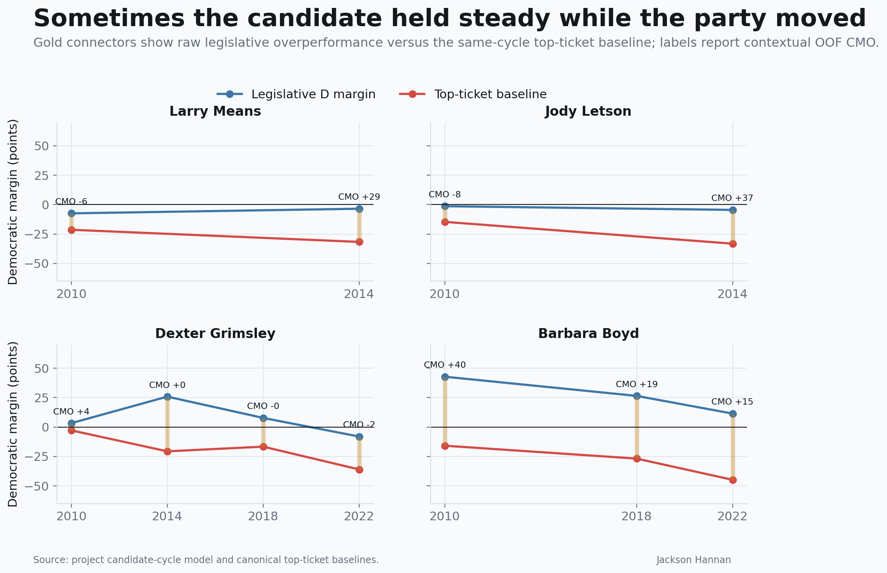
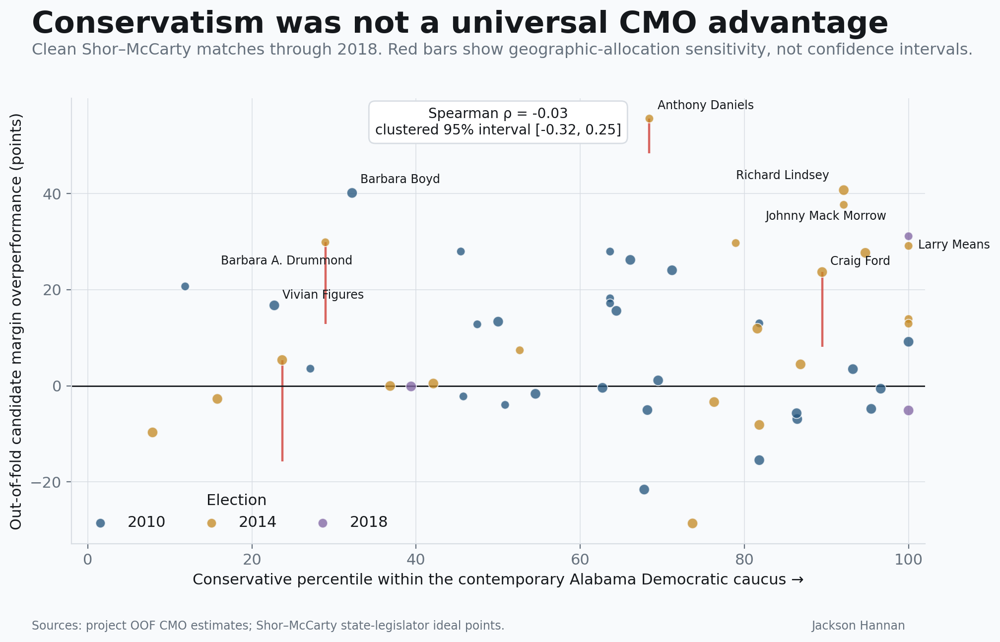
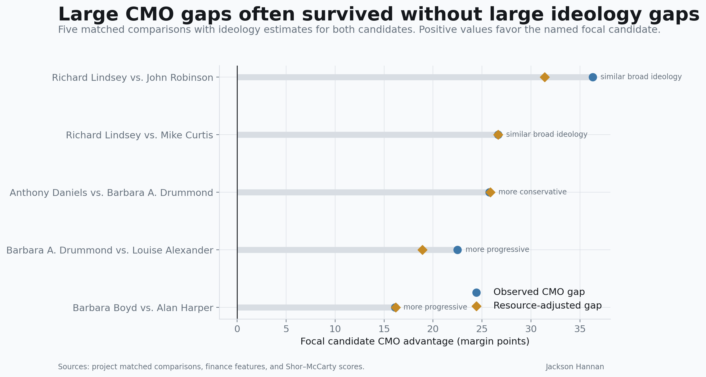
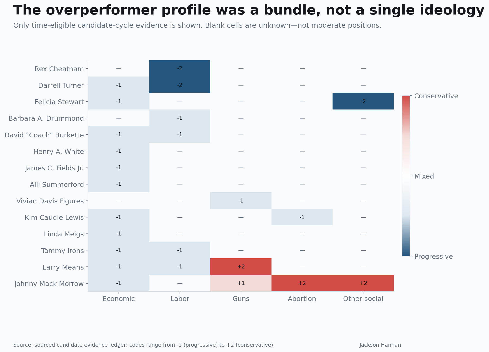

# The Last Local Democrats

## How Alabama candidates outran a collapsing party—and why “moderation” is only part of the answer

*Working draft. Statistics and wording remain subject to the final source and blind-coding audits.*

For more than a decade, Alabama Democrats have been fighting two elections at once. One is the race printed beside the candidate's name. The other is a referendum on a national party that has become increasingly unpopular across much of the state.

Some Democratic candidates lost both contests. Others built enough of a personal vote to survive—or at least to run dramatically ahead of what Alabama's statewide results suggested was possible.

The obvious explanation is ideology. Alabama's most durable local Democrats were often more conservative than the national party, especially on abortion and guns. That explanation is real. It is also incomplete.

My Candidate Margin Overperformance model compares a legislative candidate's two-party margin with an out-of-sample expectation based on the district, election cycle, incumbency, resources, and political context. The resulting CMO is measured in margin points. It is not “wins above replacement,” and it is not a causal estimate of candidate quality. It is a way to identify races where the legislative result was unusually Democratic or Republican given the available context.

The historical record points to three different routes to Democratic overperformance:

1. culturally conservative but economically populist candidates in white rural districts;
2. established local figures whose personal vote held steady while the statewide party collapsed beneath them; and
3. progressive or mainstream Democrats in Black-majority districts and changing suburbs, where community networks and coalition-specific turnout mattered more than conservative crossover.

The common thread was not moderation in the abstract. It was a credible identity that fit the district and remained stronger than the national party label.

## The apparent answer

Johnny Mack Morrow and Larry Means look like the classic answer to this puzzle.

Morrow's 2018 Senate campaign presented his established record as that of a conservative Democrat: pro-life and pro-Second Amendment, but also protective of public schools, educator retirement, rural development, and constituent accessibility. The pre-2014 record is narrower but consistent. He sponsored an armed-school-security law and advocated teacher raises, educator recruitment, math-and-science funding, and classroom investment. We have not recovered a contemporaneous 2014 abortion statement, so the later campaign description should not be silently backdated. Means had a 100 percent NRA rating and sponsored Alabama's stand-your-ground law, but also ran as a defender of public education, working families, and local economic development.

Neither man fits neatly on a single left-right line. Their offer to voters was culturally conservative and economically communitarian: guns and abortion on one side, teachers, schools, local jobs, and public investment on the other.

That bundle plausibly differentiated them from the national Democratic brand in white, lower-college districts. But Means also demonstrates why ideology cannot be the whole explanation. His estimated CMO moved from roughly negative six points in 2010 to approximately positive 29 in 2014. His core ideological identity did not transform over those four years. His political circumstances did. The 2010 campaign occurred under the shadow of an indictment. By 2014, Means had been acquitted and had completed a decisive comeback as mayor of Attalla.

Means's matched comparison reinforces the caution. Darrell Turner shared the campaign's working-family, organized-labor, and public-education themes, although his positions on guns and abortion remain unrecovered. Turner also faced an extreme spending disadvantage and late allegations about an economic-interest filing. Adjusting for resources reduces the Means–Turner CMO gap from roughly 25 points to about 13. The remaining difference is compatible with Means's cultural differentiation and restored local reputation, but it is not a clean ideological effect.

The same candidate can look weak or exceptional depending on reputation, opponents, resources, and the statewide environment. Ideology may set the terms of a personal vote; it does not determine its size by itself.

Morrow supplies the complementary persistence case. His CMO was roughly positive 28 in his 2014 House race and positive 31 in his 2018 Senate race. Those were different offices and district boundaries, so they are not a controlled repeat experiment. Still, the stability fits a durable political bundle better than a one-cycle anomaly: culturally conservative signaling, public-school commitments, rural distributive politics, and decades of constituent service moved together.

*Figure 1. Some candidates held nearly the same local vote while the statewide Democratic baseline moved sharply beneath them. Gold connectors show raw legislative overperformance; labels show contextual out-of-fold CMO, rounded to whole margin points.*

## When the party moved underneath the candidate

Jody Letson offers an even cleaner illustration.

Letson's actual Democratic margin was fairly similar in 2010 and 2014: about negative one point in the first race and negative five in the second. But the same-cycle Democratic statewide baseline in his district fell from roughly negative 15 to negative 33. His local vote did not improve. The rest of the Democratic ticket collapsed around it.

That turned a modest personal vote into an enormous measured overperformance. Letson's CMO rose from approximately negative eight to positive 37.

This is what partisan realignment looks like from the candidate's perspective. A familiar local Democrat can hold approximately the same coalition while becoming a much larger outlier relative to an increasingly Republican statewide baseline.

Nathaniel Ledbetter provides the party-switch version of the story. He posted about positive 22 CMO as the Democratic candidate in House District 24 in 2010. He later switched parties and won the same seat as a Republican in 2014. A memorandum describing a 2013 conversation reports that Ledbetter identified himself as conservative on abortion and gay rights and expected most of his former Democratic supporters to stay with him after the switch.

That document came after the scored election and was written by an interested participant, so it cannot establish what voters knew in 2010. But the expectation itself is revealing: Ledbetter believed his support belonged to him, not simply to his party.

The next Democratic nominee in the district, David Beddingfield, still produced about positive 23 CMO against Ledbetter in 2014 despite raising less than half as much money. Beddingfield had already spent years as president of the Fort Payne City Board of Education, giving him his own education-centered local base. The district sequence does not isolate ideology—we have not recovered his full platform—but it shows how local identity, resources, and party switching interacted during realignment.

James Fields demonstrates that local membership could sometimes cross an even more formidable boundary. Fields, a Black Methodist minister and longtime employment-service worker, had won an overwhelmingly white Cullman County district in a 2008 special election. In 2010 he lost reelection by about eight points, yet the same-cycle Democratic statewide baseline in the district was approximately negative 43. His raw legislative advantage over that baseline was about 34 points, and his contextual CMO was roughly positive 16.

Fields's pre-election roll-call score placed him mildly on the conservative side of the Democratic House caucus—not at its edge. His documented economics were mixed: official county minutes show him urging a half-cent sales tax to address an immediate school-funding crisis. The stronger explanation is that voters understood him as a local minister, public servant, and Cullman native. His candidacy did not erase racial polarization, but it shows that an unusually credible local identity could partially override it.

Rex Cheatham represents a different inherited Democratic institution. Before producing roughly positive 17 CMO against an incumbent Republican in 2014, Cheatham had spent ten years teaching in Morgan County schools, worked for the Alabama Education Association, and led a gubernatorial education-reform committee. He raised substantially less than his opponent, and his CMO remains strongly positive after both resource adjustments. The surviving evidence establishes an education-labor network, not his cultural ideology; his positions on guns and abortion remain unknown.

Jeff McLaughlin combines these strands. His pre-election roll-call record placed him near the conservative edge of the Democratic House caucus, and he produced roughly positive 38 CMO in 2014 despite being outraised about eight to one. Yet his public campaign was not a one-note cultural-conservative appeal. He emphasized education, infrastructure, TVA protection, clean government, and representation without special-interest money. McLaughlin had represented the district for a decade before losing in 2010, so his result is best understood as conservative relative-caucus ideology bundled with public-institution commitments and an established personal vote.

## The cases that do not move right

If conservative positioning were the universal mechanism, progressive Democrats should rarely appear among the strongest overperformers. They do.

Barbara Bigsby Boyd was on the more progressive side of the 2010 Alabama Democratic House caucus according to Shor–McCarty roll-call estimates. She nevertheless recorded roughly positive 40 OOF CMO in 2010 and remained positive in later contested elections. Boyd had represented her area since 1994 and spent decades as an educator. In her majority-Black district, longevity, community ties, and down-ballot Democratic loyalty provide a much more plausible explanation than conservative crossover.

Vivian Davis Figures supplies even clearer campaign-time evidence. Her pre-election roll-call score placed her around the 23rd conservative percentile of the Democratic Senate caucus. During the 2010 election year, she sponsored a bill creating penalties for negligently storing firearms where minors could gain access. She also had a long record of pursuing restrictions on smoking in public accommodations and workplaces.

Figures still generated positive CMO. She had represented her Mobile district since 1997 and inherited a formidable political network associated with her late husband, former Senate president pro tempore Michael Figures. Her case is not ideologically ambiguous. It is evidence that the mechanism in a majority-Black district was different.

Anthony Daniels, the largest production-score case, belongs in the same section with an asterisk. He won House District 53 in 2014 by roughly 56 margin points. The model assigns him about positive 56 CMO. Yet that exact magnitude is sensitive to how precincts are geographically allocated. Across the audited alternatives, Daniels remains an extreme overperformer but ranges from roughly positive 48 to positive 56.

No issue platform published before his 2014 election has yet been recovered. Later institutional biographies document education-association leadership that predates the campaign, while the Alabama Retail Association endorsed him in 2014. That combination suggests broad institutional acceptance rather than a conservative campaign identity. His majority-nonwhite district and the enormous gap between legislative and statewide voting also point toward coalition turnout and down-ballot loyalty.

Barbara Drummond presents a similar warning. Her production CMO is around positive 30, but alternative geographic allocations place it between approximately positive 13 and positive 30. She received Alabama Education Association support before the election and later governed as a progressive on Medicaid, gun regulation, education, and neighborhood investment. Her decades as a Mobile journalist and city and county administrator supplied deep community recognition.

These cases should not be forced into the white-rural crossover explanation merely because the same model produced their scores.

Andy Betterton makes the point in a majority-white north-Alabama district. He posted about positive 27 CMO while challenging a Republican incumbent in 2014. His contemporaneous platform supported Medicaid expansion, public-school investment, and keeping public tax dollars out of private schools. He was not offering economic conservatism. He did, however, bring two terms on the Florence school board and two terms on the city council. Betterton's case pairs progressive economics with an unusually credible local-service identity; it does not isolate which feature persuaded voters.

*Figure 2. Conservatism did not have a consistent monotonic relationship with CMO among the 52 clean candidate-cycle matches through 2018. Red ranges show sensitivity to alternative geographic allocations, not statistical confidence intervals.*

## What the systematic evidence says

The candidate stories are not the only reason to reject a simple monotonic theory.

Among 52 clean Democratic candidate-cycle matches through 2018, the rank relationship between CMO and the Shor–McCarty score—where higher means more conservative—is approximately negative 0.03. In other words, it is essentially zero. A candidate-clustered bootstrap interval spans roughly negative 0.32 to positive 0.25.

The cycle results move in opposite directions. The relationship is about negative 0.48 in 2010 and positive 0.55 in 2014. Excluding 2014 produces a negative overall association rather than a conservative advantage. Among candidates with legislative service before the election, the full-sample relationship remains near zero.

This is descriptive evidence, not a causal regression. The sample contains officeholders and candidates who could be matched to a legislative ideology dataset, only three clean 2018 matches, and no comparable post-2018 roll-call estimates. But it is sufficient to reject a confident statement that every increment of ideological conservatism produced more Democratic overperformance.

Matched comparisons tell the same story. Richard Lindsey exceeded John Robinson by roughly 36 CMO points even though their broad ideology estimates differed by only about 0.04. Both were near the conservative end of their Democratic House caucus and both received substantial AEA support. But Lindsey had represented his district for 31 years and faced a challenger with only about $5,900 in observed fundraising, while Robinson faced a locally rooted challenger in an approximately $109,000-to-$125,000 contest. Resource adjustment explains only about five points of their CMO gap; ideology explains even less. Across the five production-score pairs with ideology scores on both sides, the higher-CMO candidate was more conservative once, more progressive twice, and in approximately the same broad ideological range twice.

Even that summary is too generous to ideology. Barbara Drummond's production CMO exceeds Louise Alexander's by roughly 22.5 points, producing one of the “more progressive” classifications. But both ideal points come from service after the election. Drummond also had a roughly ten-to-one fundraising advantage over her Republican opponent, while Alexander faced a nationally profiled Republican conducting intensive community outreach. Most importantly, the geography audit reduces the possible Drummond–Alexander gap to less than one point at its narrowest. The production direction survives by a sliver; the substantive difference does not.

The largest matched gap is even less clean. Henry White exceeded Jennifer Marsden by roughly 53 CMO points in 2014. White combined a relatively conservative Democratic roll-call record with public-school advocacy and extraordinary Limestone County roots; Marsden ran an explicitly progressive economic campaign in the Wiregrass. Yet White's own CMO had moved by about 34 points since 2010 while facing the same Republican opponent. Marsden, meanwhile, faced Steve Clouse, a twenty-year incumbent and powerful budget chairman who himself supported a conditional Medicaid expansion. Her 23.3 percent vote share was almost identical to the previous Democrat's 22.3 percent. The comparison is compatible with ideological congruence helping White, but it cannot distinguish that story from local embeddedness, opponent strength, or a changing district baseline.

Simple tenure is not enough either. Years of legislative service have almost no rank relationship with CMO. The relevant personal vote appears to be relational: constituent service, occupation, local organizations, family networks, reputation, and the strength of the opponent. Those qualities cannot be reduced to years in office.

The unresolved cases reinforce that caution. Napoleon Bracy's approximately positive 21 CMO in 2010 falls to about positive 13 after accounting for a large fundraising advantage; his later progressive roll-call record cannot be projected backward into a race held before he entered the Legislature. Greg Varner's positive 15 CMO falls to roughly positive eight after fundraising adjustment, and he faced Gerald Dial—a former Democratic officeholder running as a Republican with decades of personal recognition. Neither case currently supports an ideological conclusion.

Jerry Fielding is another apparent conservative-Democrat case that dissolves under closer temporal inspection. He later switched parties and publicly opposed same-sex marriage, abortion, and gun control. But those statements came in 2012, after redistricting made his seat more Republican. What can be established before his positive 18 CMO victory is different: Fielding had spent 26 years as a local judge, and the Republican incumbent abandoned the race in September. Republicans installed a replacement nominee only eight weeks before Election Day. Local recognition and opponent disruption are demonstrated; a 2010 cultural platform is not.

*Figure 3. The five production-score comparisons do not point in one ideological direction. Resource adjustment changes some gap sizes, while geographic sensitivity nearly eliminates the Drummond–Alexander gap. These are structured comparisons, not causal estimates.*

## A better theory: district-congruent differentiation

“Moderation” treats Alabama as if every district rewards movement toward the same statewide midpoint. The evidence suggests something more conditional.

In white rural districts, differentiation from the national Democratic brand often included conservative positions on guns and abortion. But those positions were bundled with public-school advocacy, economic populism, and strong local roots. Voters were not necessarily choosing a generic centrist. They were choosing a familiar local Democrat whose values and material priorities resembled the district.

In majority-Black districts, progressive candidates could overperform through long community relationships, organizational networks, and stronger Democratic loyalty down ballot than at the statewide level.

In suburban districts, candidates such as Alli Summerford, Felicia Stewart, Linda Meigs, and Kim Caudle Lewis generated positive contextual CMO while running on education and health care rather than conservative cultural differentiation. Stewart explicitly resisted conservative culture-war politics. Meigs advocated Medicaid expansion and an education lottery in 2018. Lewis emphasized education and protecting reproductive choice after *Dobbs* in 2022 while bringing an unusually strong business and civic résumé as a local technology executive and former Huntsville/Madison County Chamber chair. The 2018 candidates did not win and ran behind Alabama's unusually strong Democratic statewide ticket on the raw comparison, but the contextual model still found their results stronger than expected. Lewis also lost narrowly, yet her roughly +15 CMO remained after resource adjustment.

The general mechanism is therefore district-congruent differentiation: a candidate overperformed when voters encountered a credible local identity that fit their coalition and overrode some portion of the national party cue. What constituted “fit” differed across Sand Mountain, the Black Belt, Mobile, Huntsville, and Birmingham's suburbs.

*Figure 4. Recovered campaign-time issue evidence forms bundles rather than a single ideological scale. Blank cells mean the position remains unknown from time-valid evidence; they do not imply neutrality.*

## What this means for Democrats now

This history does not yield a simple recruitment formula for 2026. CMO is retrospective, and the model's cross-cycle predictive performance remains limited. The research also cannot recover every candidate platform from small local races held more than a decade ago.

It does suggest what not to do. Democrats should not assume that attaching a generic “moderate” label to an unfamiliar candidate recreates the personal vote of politicians who spent decades in local schools, city halls, civic groups, churches, unions, businesses, and constituent service.

Ideological congruence can matter. Local credibility appears to determine whether voters believe it. And as Alabama's partisan baseline moved, the Democrats who held up best were often those who had built an identity durable enough to remain standing while the party moved underneath them.

## Methodological note and source trail

- Headline candidate scores use out-of-fold CMO rather than in-sample residuals.
- CMO is a margin-overperformance index, not literal wins added or a causal candidate effect.
- The overall ideology comparison uses Shor–McCarty state-legislator ideal points and person-clustered bootstrap intervals.
- Later evidence is excluded from election-cycle issue codes unless it documents a preexisting fact and is explicitly labeled retrospective.
- Forty-six candidate-dimension codes were independently reviewed from a CMO-free, identity-redacted packet. The reviewer agreed exactly on 40; all six disagreements concerned intensity rather than ideological direction. Three reviewer codes were adopted and three original codes retained under documented adjudication rules.
- 2014 headline cases display full-model geography-sensitivity ranges.
- Reproducible tables and candidate source memos are in `research/cmo_ideology/`.
